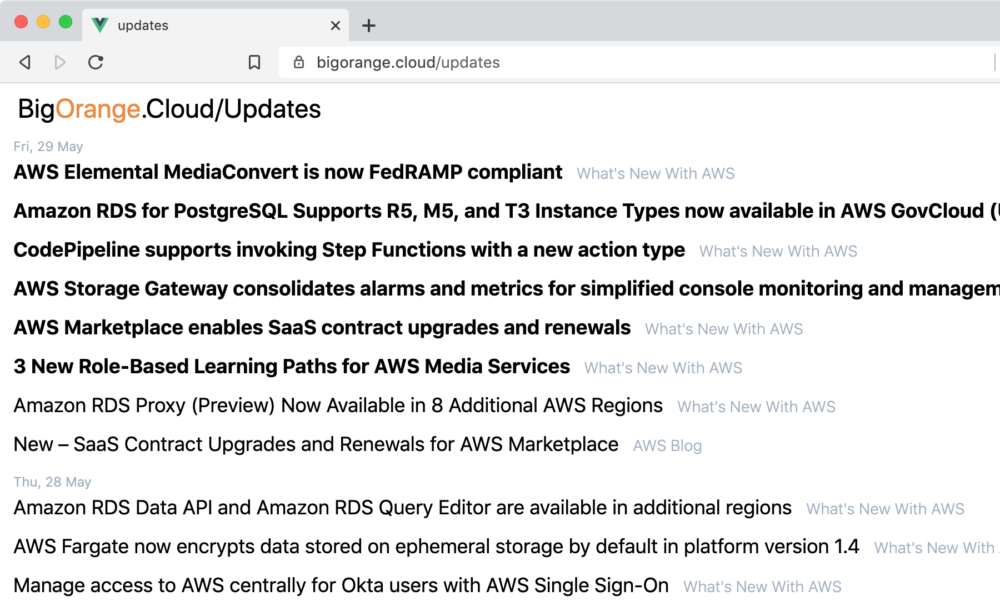
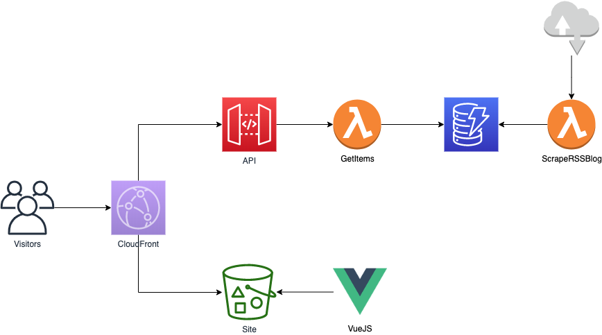
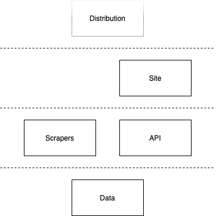

# BigOrange.Cloud/Updates

Keeping up with AWS updates is hard, so I created
[BigOrange.Cloud/Updates](https://bigorange.cloud/updates) to do it for me.

Before this, the best way I'd found was piping the various RSS feeds in to my
Slack (and [I'm not the only
one](https://www.reddit.com/r/aws/comments/g0itdu/q_how_do_you_keep_up_with_aws_new_announcements/)),
but that's no fun.

Items that have appeared since you last visited **will be shown in bold**, so
you know what's new.



## Architecture



## Sources

* [AWS Blog]()
* [What's New With AWS]()
* [API Changes]()

### Planned

* Other AWS blogs
* AWS CVEs
* [AWS Status](https://status.aws.amazon.com/) LOL!

### Layers

Components are deployed via CloudFormation (and
[SAM](https://github.com/awslabs/serverless-application-model/blob/master/versions/2016-10-31.md))
as layers, so that dependencies are managed cleanly.



Note that the CloudFront Distribution is managed separately, as it fronts
multiple applications.

## Deploy

### Data

Updates are stored as items in a [DynamoDB](https://aws.amazon.com/dynamodb/)
table.

```
make data.template
```

### Scrapers

```
make scrapers.template
```

### API

This site uses a [API Gateway HTTP
API](https://docs.aws.amazon.com/apigateway/latest/developerguide/http-api.html).

```
make scrapers.template
```

### Site

#### Infrastructure

```
make site.template
```

#### Application

This website follows the [Immutable Web Apps](https://immutablewebapps.org/)
standard. The steps to deploy are:

1. Build the site
1. Inject configuration variables
1. Sync the site contents
1. Update the `cache-control` on `index.html`

```
npm install
NODE_ENV=production npm run build
export API=<ENDPOINT_URL>
sed -i "s~INSERT_API~${API:-API_NOT_SET}~g" dist/index.html
aws s3 sync dist/ s3://$SITE_BUCKET/updates/
aws s3 cp s3://$SITE_BUCKET/updates/index.html \
  s3://$SITE_BUCKET/updates/index.html --metadata-directive REPLACE --cache-control no-cache
```

## Development

Environment variables are not injected in to the `index.html` in development,
they're sourced from environment variables.

To run the front-end locally:

```
VUE_APP_API=$API
npm run serve
```

### Testing

All tests (for functions and front-end) live in `/tests`:

```
npm run test:unit
npm run test:unit:watch
```
